# Precipitation Nowcasting with Deep Learning

This repository contains implementations of several SOTA's and custom models for precipitation nowcasting. The goal is to predict future rainfall radar frames based on a sequence of past frames.

> We explore and compare various architectures, including Transformer-based, diffusion-based, and physics-informed models.

The core challenges include:

* **Incomplete Data Representation**: Radar data can often be noisy or sparse.
* **Deterministic Model Limitations**: Standard models often predict a blurry average of possible futures rather than a single, sharp, and plausible outcome.
* **Enhancing Probabilistic Models**: While probabilistic models can capture multiple futures, they can be improved by injecting prior physical knowledge and constraints.

---

## Models Included

This repository includes the following models:

* **Diffcast**: A residual diffusion-based model. It can be paired with different deterministic backbones to first generate point estimation and then condition diffusion UNet to generate sharp frame.

  * **Backbones Used**: Earthformer, FNO, PhyDNet.

* **PreDiff**: It combines the **Earthformer** backbone with a **Knowledge Alignment** module. This alignment is designed to enforce physical constraints, such as the conservation of energy, leading to more physically plausible predictions.

* **Earthformer**: A transformer-based model designed for spatiotemporal forecasting.

* **FNO (Fourier Neural Operator)**:It operates in the frequency domain, allowing it to learn resolution-independent dynamics.

* **PhyDNet**: A physics-informed model that decomposes the prediction task into physics-constrained and residual components, aiming to capture both predictable physical motions and more stochastic elements.

* **CasCast**: A Diffusion-Transformer model used for spatiotemporal forecasting.

---

## 📊 Performance Metrics

> Note that all other models are pre-trained, whereas **Diff-Earthformer** and **Diff-FNO** were trained for only one epoch.

| Metric    | Diff-Earthformer | Diff-FNO | Diff-PhyDNet | PreDiff (Aligned) | PreDiff (Non-Aligned) | CaCast     |
| :-------- | :--------------- | :------- | :----------- | :---------------- | :-------------------- | :--------- |
| **CSI**   | 0.1875           | 0.0422   | 0.2760       | 0.3489            | **0.4639**            | 0.3226     |
| **POD**   | 0.2700           | 0.0548   | 0.3686       | **0.8725**        | 0.7863                | 0.3970     |
| **SSIM**  | 0.5344           | 0.5258   | 0.6180       | **0.6285**        | 0.5390                | **0.7201** |
| **HSS**   | 0.2430           | 0.0498   | **0.3591**   | ---               | ---                   | **0.3993** |
| **MAE**   | 12.215           | 15.880   | **11.426**   | ---               | ---                   | ---        |
| **PSNR**  | 22.262           | 19.897   | **24.083**   | ---               | ---                   | 21.7194    |
| **LPIPS** | 0.4409           | 0.4938   | **0.1958**   | ---               | ---                   | ---        |
| **CRPS**  | ---              | ---      | ---          | ---               | ---                   | **0.0256** |

*CSI (Critical Success Index) and POD (Probability of Detection) are key metrics for forecast quality. Higher is better for CSI, POD, SSIM, HSS, and PSNR. Lower is better for MAE and LPIPS.*

---

## 🖼️ Visualizations

Here are some visual results from the different models, comparing their predictions to the ground truth (target) frames.

### **Diffcast with PhyDNet Backbone**

This shows the probabilistic prediction frames generated by the diffusion model alongside the actual target frames.

|                                      Predictions                                     |                                       Targets                                       |
| :----------------------------------------------------------------------------------: | :---------------------------------------------------------------------------------: |
| 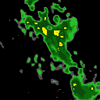 | 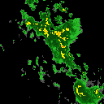 |

---

### **Diffcast with Earthformer Backbone**

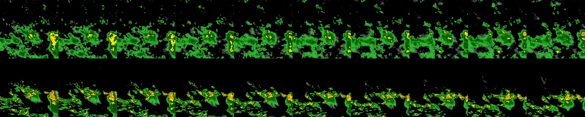  
*Above: Predicted, Below: Target*  

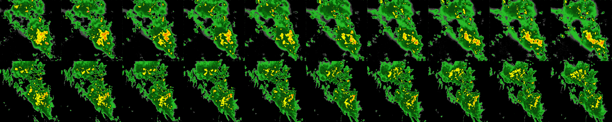  
*Above: Predicted, Below: Target*  

---

### **Diffcast with FNO Backbone**

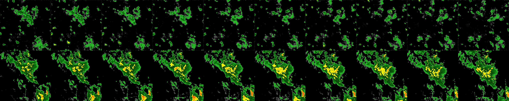  
*Above: Predicted, Below: Target*  

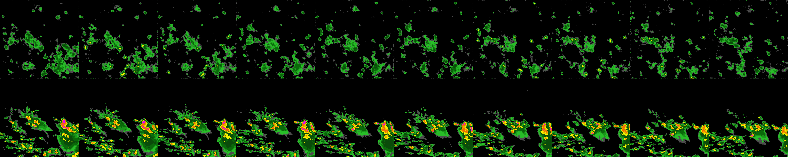  
*Above: Predicted, Below: Target*  

---

### **PreDiff (Knowledge-Aligned Earthformer)**

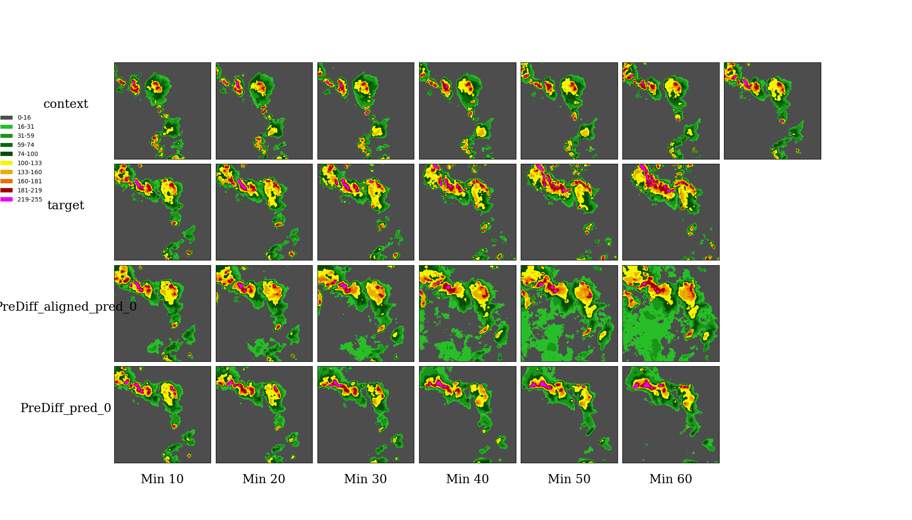  
    
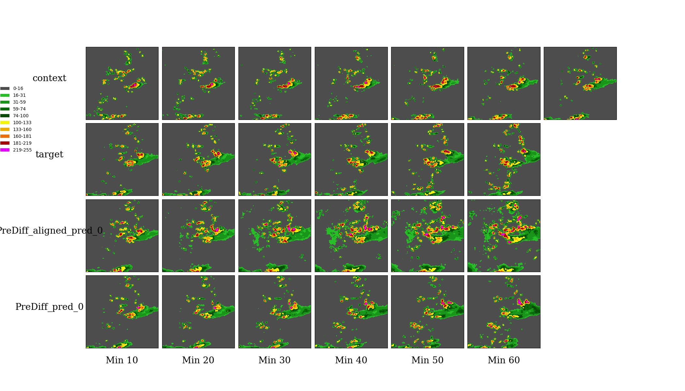

---

### **Standalone Earthformer**

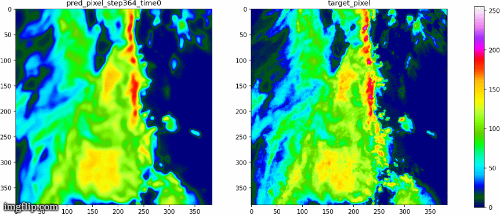  
    
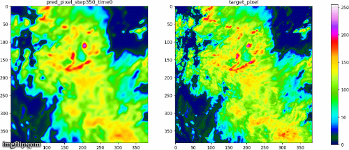  
    

---

### **Standalone FNO**

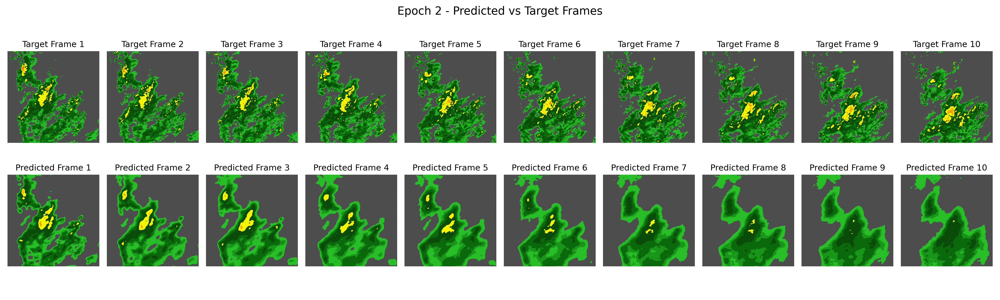  
    
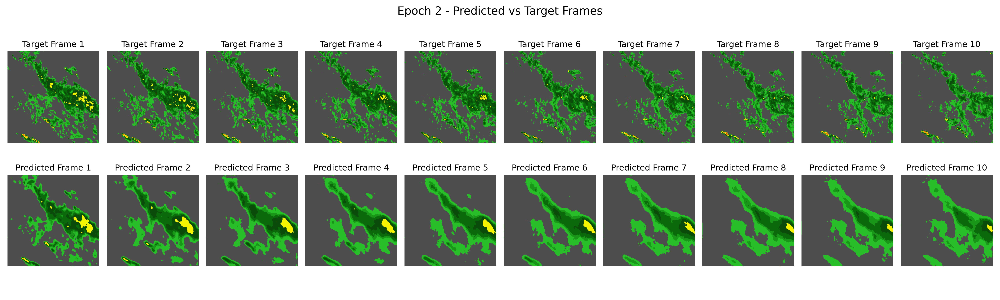

---

### **CasCast**

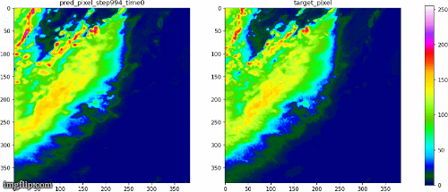  
    
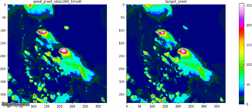

---

